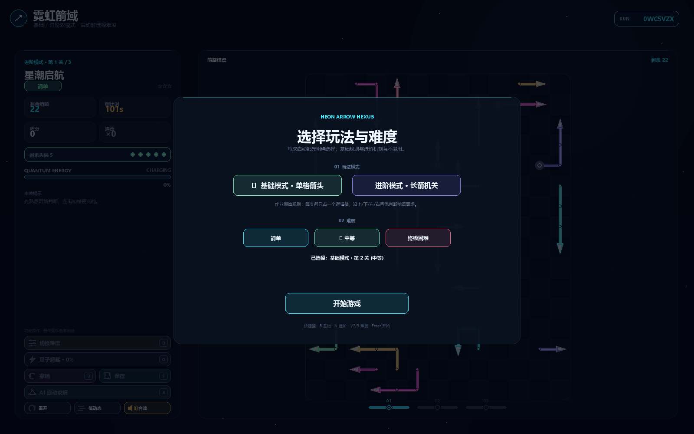
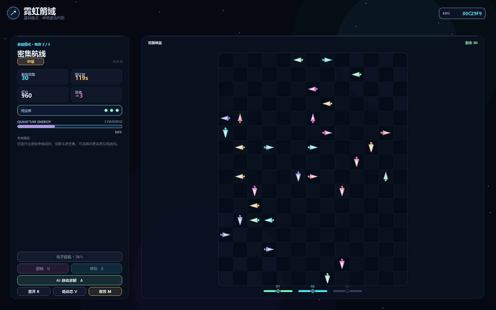
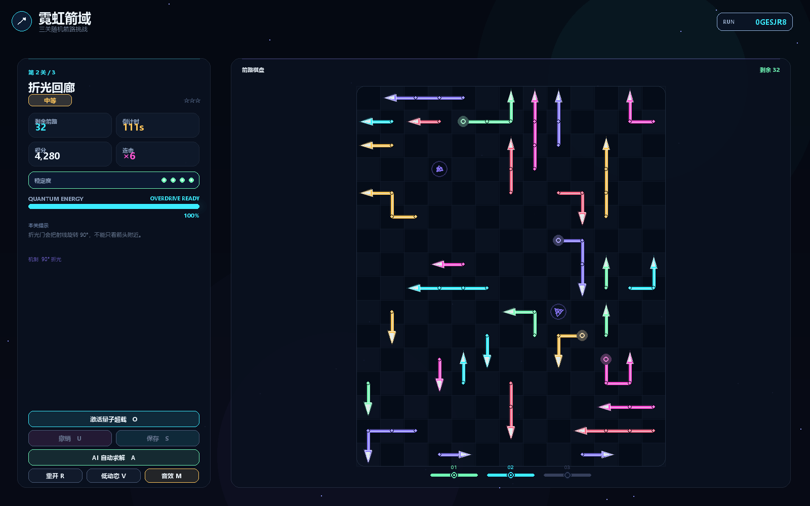
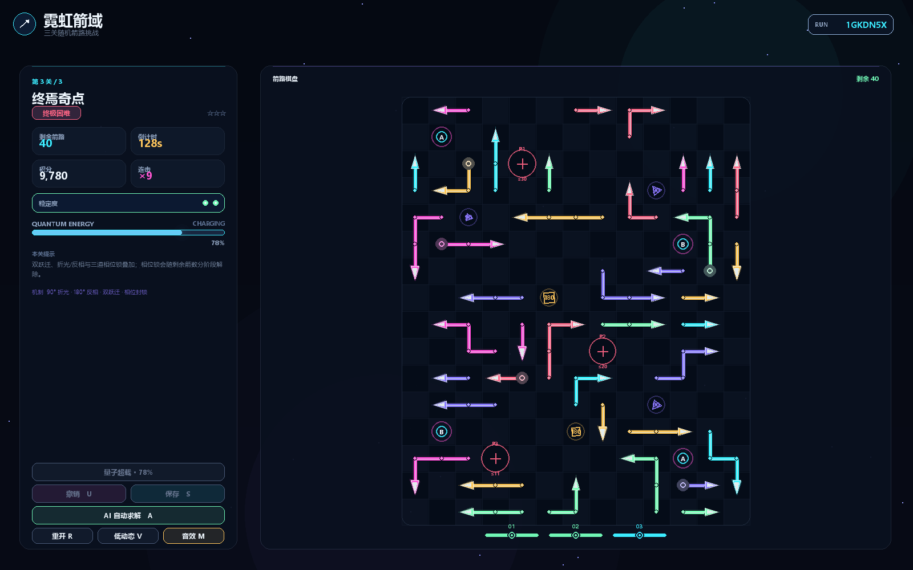
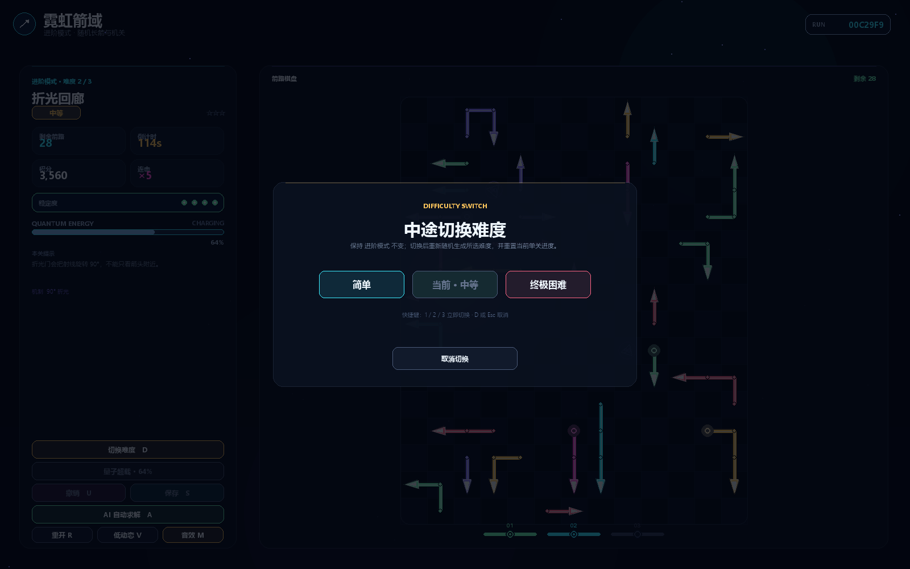
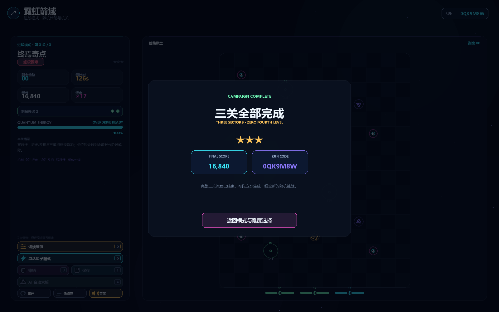
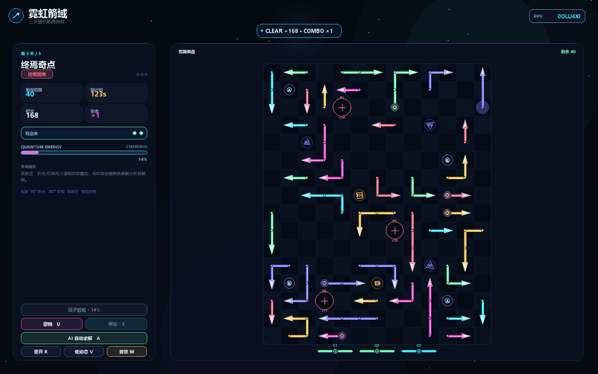
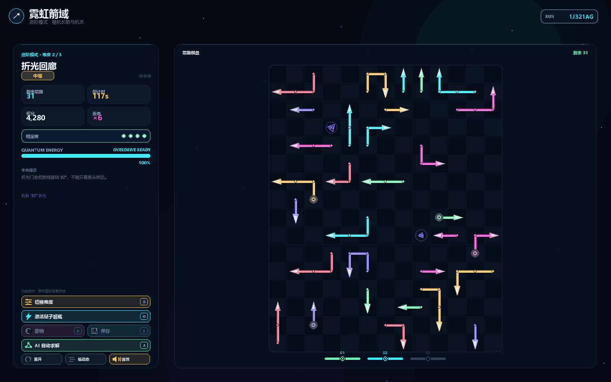

# 2026 秋软件工程个人作业（第二次）——霓虹箭域 Neon Arrow Nexus

| 项目 | 内容 |
| --- | --- |
| 这个作业属于哪个课程 | [202601 软件工程](https://edu.cnblogs.com/campus/fzu/202601SofwareEngineering) |
| 这个作业要求在哪里 | [2026 秋软件工程个人作业（第二次）](https://edu.cnblogs.com/campus/fzu/202601SofwareEngineering/homework/16717) |
| 这个作业的目标 | 使用 Python 和 AIGC 完成“一箭又一箭”小游戏，并完成测试、AIGC 使用记录与项目总结 |
| 学号 | 【提交前填写】 |
| GitHub 仓库 | https://github.com/endlessmaybe/neon-arrow-nexus |

> 本文对应仓库最终提交版。GitHub 地址已填写；正式发布到博客园前，只需要补上学号，并把文中的仓库相对图片上传到博客园后替换为博客园图片地址。

## 一、项目展示

这次我做的是一个 Python + Pygame 的“一箭又一箭”小游戏，项目名为 **霓虹箭域（Neon Arrow Nexus）**。我没有把扩展玩法直接覆盖题目本身，而是把程序分成 **基础模式** 和 **进阶模式**：

- 基础模式严格保留题目要求的单格四方向箭头与直线路径判定；
- 进阶模式在基础规则之上加入随机长箭、折光、反相、跃迁和相位锁等机制；
- 两种模式都只有三档难度：**简单 / 中等 / 终极困难**；
- 两种模式都对应 **3 个可通关关卡**。从简单开始会按第 1 → 2 → 3 关连续推进，通关结算后可进入下一关；
- 每次打开程序都要先选择模式和难度，游戏过程中也可以按 `D` 切换难度。

### 1. 启动界面



### 2. 基础模式



基础模式中的箭头在逻辑上只占一个格子。点击后只检查箭头朝向到棋盘边界之间是否存在其它箭头，不使用折光、跃迁等进阶机制。

### 3. 进阶中等难度



中等难度开始出现折光门，射线经过后会改变方向，因此不能只观察箭头正前方的一小段区域。

### 4. 进阶终极困难



终极困难使用更高密度的 2–4 格随机长箭，并加入反相门、两组跃迁环和三道分阶段相位锁。难点主要来自高密度阻挡、跨区域射线和更紧的容错，而不是固定背一套唯一答案。

### 5. 游戏中切换难度



按 `D` 或点击侧栏“切换难度”可以在游戏中重新选择简单 / 中等 / 终极困难。选择面板打开期间会暂停倒计时和 AI 自动求解。

### 6. 通关界面



清空当前关所有箭头后进入结算界面，并根据剩余时间和状态给出星级评价。

## 二、项目介绍

### 1. 基础规则

“一箭又一箭”的核心规则并不复杂：

1. 棋盘中的箭头只有上、下、左、右四个方向；
2. 点击某个箭头后，从它的前方开始沿当前方向检查；
3. 如果一直到棋盘边界都没有其它箭头阻挡，则箭头飞出并消失；
4. 如果路径上存在其它箭头，则本次点击失败，箭头保留并扣除一次容错；
5. 清空本关所有箭头则进入通关结算，并可继续进入下一关；完成第 3 关后显示三关挑战完成；
6. 容错耗尽或倒计时结束则失败，可重新开始。

基础模式完全按照以上规则实现。为了让方向更容易看清，画面会给单格箭头画一小段箭身，但这只是显示效果，不会改变“逻辑上只占一个格子”的判定。

### 2. 三个关卡与三档难度

| 难度 | 基础模式 | 进阶模式 |
| --- | --- | --- |
| 简单 | 18–22 支单格箭，3 次容错 | 18–22 条 2–4 格随机长箭 |
| 中等 | 28–34 支单格箭，3 次容错 | 27–32 条长箭 + 折光门 |
| 终极困难 | 40–48 支高密度单格箭，3 次容错 | 38–42 条长箭 + 折光/反相 + 双跃迁 + 3 道相位锁 |

这三档同时对应正式流程的第 1 / 2 / 3 关。选择“简单”开始时会完整经历三关；每关清空后先显示结算，再通过“进入下一关”继续。选择中等或终极困难则可以直接从对应关卡开始，方便单独验收高难度内容。

程序代码层只接受三档难度，不存在第 4 档。每次新开局都会生成新的 RUN；同一个 RUN 可以复现同一张地图，方便定位问题和回归测试。

### 3. 主要扩展功能

- `U`：撤销上一步；
- `A`：AI 自动求解当前关；
- `R`：重开当前关；
- `D`：游戏中切换难度；
- `O`：能量满后使用一次量子超载；
- `M`：音效开关；
- `V`：低动态模式；
- 自动存档与继续游戏；
- 得分、连击、倒计时、星级评价；
- 成功飞出、碰撞、机制状态等动画反馈；
- Windows 单文件 EXE，可直接双击运行。

最终版本删除了会直接告诉玩家“哪支箭安全”的快捷提示。鼠标悬停只做视觉高亮，保留玩家自己判断的过程。

## 三、核心实现思路

### 1. 路径检测

基础模式最核心的逻辑就是“沿方向一直扫到边界”。例如向右箭头，可以抽象为：

```python
x += 1
while x < board_width:
    if (x, y) in occupied:
        return False
    x += 1
return True
```

上下左右只是在坐标增量上不同，因此程序统一使用方向向量处理，避免为四个方向分别写四套互相容易出错的判断。

进阶模式仍然沿用“从箭头头部出发追踪完整射线”的思路，只是在射线经过折光、反相、跃迁和相位锁时继续更新路径。所有机关都真正进入同一套射线计算，而不是只画在界面上。

### 2. 随机关卡为什么不会直接生成死局

最初我试过“随机摆箭，再看看能不能玩”，很快就发现这样很容易得到互相堵死的局面。

最后采用的是反向构造：从空棋盘开始，每次只加入一条在当前局面下能够安全离场的箭，记录构造顺序，全部放完后把顺序反过来，就得到至少一条完整可行解序。

```python
while len(construction_order) < target:
    candidate = generate_candidate(...)
    if candidate is None:
        continue

    if candidate_can_exit(candidate, occupied):
        place(candidate)
        construction_order.append(candidate)

solution_order = list(reversed(construction_order))
```

生成完成后还会重新按正式游戏规则执行一遍完整解序。这样“随机”负责变化，“验证”负责保证地图不是死局。

### 3. 基础模式与进阶模式为什么要拆开

开发中间我曾经把进阶长箭做得太完整，反而把题目原始的单格玩法挤没了。重新核对作业后，我把规则真正拆成两套生成入口：

- `create_basic_level()`：单格箭头、四方向直线判阻、没有进阶机关；
- `create_level()`：2–4 格真实长箭，并使用折光、反相、跃迁和相位锁。

这样老师验收基础要求时可以直接进入基础模式，扩展内容也不会和题目主体混在一起。

### 4. 程序结构

```text
.
├─ main.py
├─ requirements.txt
├─ requirements-dev.txt
├─ neon_arrow/
│  ├─ __init__.py
│  ├─ engine.py
│  └─ app.py
├─ tests/
│  ├─ test_python_engine.py
│  ├─ test_python_app.py
│  ├─ test_python_features.py
│  └─ test_assignment_acceptance.py
├─ scripts/
│  └─ build-python.ps1
├─ dist/
│  └─ NeonArrowNexus-Python.exe
└─ docs/
   ├─ AIGC_LOG.md
   ├─ TEST_REPORT.md
   ├─ ASSIGNMENT_REQUIREMENTS.md
   └─ screenshots/
```

`engine.py` 主要负责规则、关卡生成、射线和可解性；`app.py` 负责 Pygame 界面、输入、状态机、动画和存档。规则层和界面层分开后，自动测试不需要每次都人工点完整个游戏。

## 四、AIGC 使用过程

本次开发主要使用 ChatGPT / GPT-5.6 Sol 辅助需求拆解、代码实现、调试和测试。实际过程不是“我发一句提示词，AI 一次性把游戏写完”，而是我不断试玩、对照题目、指出问题，再让 AI 修改并重新验证。

下面先用一张表概括主要协作内容，再把其中 **三次真实对话** 直接放进正文。对话做了压缩和措辞润色，删除了重复内容，但保留了我当时提出的问题、AI 的处理方向以及后续实际修改结果。

| 子任务 | 借助何种 AIGC 技术 | AI 实现或提供了什么 | 实际效果 | 人工修改 / 验证 |
| --- | --- | --- | --- | --- |
| 随机可解关卡 | ChatGPT / GPT-5.6 Sol | 提出反向构造思路，并保存可执行解序 | 随机关卡不再只靠“生成后碰运气”，可以得到至少一条完整可行顺序 | 加入固定种子复现、完整解序回放和多 RUN 压力测试 |
| 技术路线修正 | ChatGPT / GPT-5.6 Sol | 将早期网页原型的规则迁移到 Python/Pygame | 正式实现回到作业要求的 Python 技术路线 | 删除旧 HTML/JS/Node 正式提交链，只保留 Python 主线 |
| 基础玩法纠偏 | ChatGPT / GPT-5.6 Sol | 建议拆成基础/进阶两套规则入口 | 基础单格四方向玩法与扩展长箭机制真正分离 | 新增 `create_basic_level()`，并验证基础模式不加载任何进阶机关 |
| UI 与动画 | ChatGPT / GPT-5.6 Sol | 建议做视觉减法，并让箭头先走、箭身沿原路径跟随 | 界面信息更集中，长箭离场不再表现为整根图形平移 | 删除多余装饰，重写有序离场动画并重新截图核对 |
| 图标与性能 | ChatGPT / GPT-5.6 Sol | 统一矢量图标，并缓存静态绘制结果 | 功能入口更容易理解，1600×1000 下平均帧耗时从 18.657 ms 降到 7.729 ms | 增加用途说明，跑固定窗口连续帧基准并补高密度随机回归 |
| 测试与交付 | ChatGPT / GPT-5.6 Sol | 建议使用 pytest、headless check 和 EXE 分层验收 | 源码、随机地图、Pygame 流程和最终 EXE 都有独立验证证据 | 将 T01–T06 写成独立验收测试，并对最终 EXE 再跑 `--headless-check` |

### 第一次对话：我发现基础模式其实被做丢了

当进阶长箭、机关和随机生成已经比较完整时，我重新对照作业要求，才发现一个比“界面好不好看”更严重的问题：题目最基础的单格四方向箭头玩法没有被独立保留下来。

> **我：** 我重新检查了一遍作业要求。现在进阶模式做得很多，但基础模式没做出来。基础玩法应该是单格箭头，只判断上、下、左、右到棋盘边界之间有没有其它箭头。另外，每次打开游戏时应该先选择模式和难度，不能因为存在存档就直接跳进去。
>
> **ChatGPT：** 这不是改文案就能解决的问题，需要把规则层拆开。基础模式单独使用单格箭头生成器，不加载折光、反相、跃迁和相位锁；进阶模式继续保留 2–4 格长箭。启动流程也要改成固定先进入选择页，只有模式和难度都选好后才允许开始；旧存档可以继续保留，但不能绕过选择页。

这轮修改后，我实际检查了启动页和基础模式，确认两种模式已经真正分开，而不是只在菜单里多了两个名字。随后又补了“已有存档也必须回到 setup”“基础模式不存在进阶机关”“同模式同难度才能继续旧进度”等自动化测试。


这里也暴露了一个问题：AI 很容易顺着“继续增加功能”的方向往前做，但如果没有人重新核对题目，复杂功能反而可能把最基本的评分点覆盖掉。

### 第二次对话：我要求界面做减法，长箭不能整根平移

在一次完整试玩中，我觉得界面已经开始出现“什么都有，但信息太多”的问题，而且长箭离场只是整根图形一起移动，看起来不像箭体沿着自己的方向逐段出去。

> **我：** 整体界面需要再简化，现在视觉元素太多，看起来比较乱。另外长箭离场不能整根一起平移，我希望它沿箭头方向有序离场：头部先走，后面的箭身沿原来的折线路径逐段跟上。
>
> **ChatGPT：** 界面这轮以做减法为主，删除扫描线、光谱丝带、透视网格、轨道圈、多层玻璃高光等非必要装饰；离场动画改成“箭头先前进，箭身沿原折线路径逐段跟随并拉直”，后半段再渐隐，不再把整根箭当成一张图片平移。

这次我没有只看“代码改没改”，而是重新生成了离场过程截图，并继续调整动画时间，让淡出在肉眼上能够明显看到。最终正常模式离场约 0.86 秒，L 形长箭的不同节点会产生不同位移，测试也专门防止以后又退回“整体平移”。



这一轮让我比较直观地感受到，AIGC 可以把动画逻辑很快实现出来，但“动起来”和“动得像想要的效果”是两回事，后者仍然要靠实际观察和反复反馈。

### 第三次对话：图标不能靠猜，性能也要一起收尾

后期功能变多以后，侧栏按钮虽然都有作用，但只看图标不一定能立刻知道用途；同时我也希望最后再做一次性能检查，而不是只顾功能数量。

> **我：** 这些功能图标要能说明用途，不要让人靠猜；图标本身也统一一下。另外再检查一遍性能，看看有没有明显的重复绘制和不必要开销。
>
> **ChatGPT：** 侧栏 8 个核心功能统一为 Pygame 矢量线条图标，同时保留文字和快捷键，并增加悬停用途说明。性能方面缓存静态背景、文字、光晕、棋盘网格和布局几何，复用全屏透明 Surface，空粒子时直接跳过特效层，再用固定窗口连续跑帧做前后对比。

实际基准是 1600×1000、连续 120 帧：平均帧耗时从 **18.657 ms** 降到 **7.729 ms**，约从 53.6 FPS 提升到 129.4 FPS。更重要的是，这次性能回归还顺手暴露了一个高密度随机关卡边界：RUN `268185663` 在终极困难下偶发生成失败。这个问题随后被加入固定回归用例，不能因为“平时大多数地图都能生成”就忽略。



在这之后我又发现“启动时能选难度”还不够，游戏进行中也需要切换入口，于是补了 `D` 难度面板。这也是整个开发过程比较典型的节奏：**先有一个能工作的版本，再由实际试玩发现遗漏，继续修改并把新要求写进测试。**


完整的长周期迭代记录仍保留在仓库的 `docs/AIGC_LOG.md`，但博客正文已经把最有代表性的三次协作直接展开，不需要读者再跳到另一个文件才能看到 AIGC 是怎样参与开发的。

我这次最大的体会是：AIGC 很适合快速提供“可以继续讨论的版本”，但它不会自动知道当前实现是否仍然符合题目，也不会替我判断视觉是否过度、交互是否自然、随机边界是否真的稳定。早期网页原型、进阶模式覆盖基础模式、长箭整体平移，以及高难度生成偶发失败，都是“能运行但还不能交”的例子。

## 五、测试结果

### 1. 作业要求 T01–T06

下面六项按作业要求单独列出。最终程序不仅有自动化测试，我也让正式 Pygame 流程和打包 EXE 参与验收。

| 编号 | 测试内容 | 预期结果 | 实际结果 | 是否通过 |
| --- | --- | --- | --- | --- |
| T01 | 点击前方无阻挡的箭头 | 箭头飞出棋盘并消失 | 箭头进入离场动画，完成后从棋盘移除，剩余数减少 | 通过 |
| T02 | 点击前方有阻挡的箭头 | 箭头不消失，失误次数减 1 | 箭头保留并出现碰撞反馈，容错减少 1 | 通过 |
| T03 | 点击位于边缘且朝向棋盘外的箭头 | 正常消失，不发生越界错误 | 四个方向的边缘情况均能正常离场，无索引越界 | 通过 |
| T04 | 清除本关全部箭头 | 显示通关并进入下一关 | 最后一支箭完成离场后进入通关结算，点击“进入下一关”会加载下一关并恢复游戏状态 | 通过 |
| T05 | 失误次数耗尽 | 显示失败并允许重新开始 | 容错归零后进入失败状态，可重新挑战当前关 | 通过 |
| T06 | 游戏进行中重新开始 | 箭头布局和失误次数恢复 | 同一 RUN 的初始布局、状态、计时与容错全部恢复 | 通过 |

### 2. 自动化测试

运行：

```bash
python -m pytest -q tests/test_python_engine.py tests/test_python_app.py tests/test_python_features.py tests/test_assignment_acceptance.py
```

最终实测：

```text
61 passed
```

其中 `tests/test_assignment_acceptance.py` 专门把 T01–T06 写成 6 个独立测试。除此之外，全量回归还覆盖：

- 每次启动必须先选择模式与难度；
- 连续帧复用透明特效层时仍保持 per-pixel alpha，不会从第二帧开始出现大面积黑屏；
- 标准启动进入正式关卡流程而不是单关训练；从第 1 关通关后可以进入第 2 关；
- 基础模式全部为单格箭，且没有折光/跃迁/相位锁；
- 进阶模式仍使用 2–4 格真实长箭；
- 同 RUN 可复现、不同 RUN 会变化；
- 64 个 RUN × 3 档进阶随机生成压力回归；
- 第三档 38–42 条随机长箭完整可解；
- 折光、反相、双跃迁和三道相位锁真实改变射线路径；
- 撤销、存档恢复和 AI 自动求解；
- 游戏中 `D` 切换难度；
- 功能按钮悬停说明；
- 低动态和音效设置持久化；
- 已知高密度 RUN `268185663`、`2111439849` 的生成回归，终极困难使用 64 轮确定性重试预算兜住稀有高密度边界。

另外运行：

```bash
python main.py --headless-check
```

这个检查会真的创建游戏状态、找到一条可离场箭、执行一次正式点击逻辑并检查剩余箭数和积分变化，不是只做 import。

### 3. EXE 验证

构建命令：

```powershell
powershell -ExecutionPolicy Bypass -File scripts/build-python.ps1
```

生成：

```text
dist/NeonArrowNexus-Python.exe
```

最终版 EXE 也单独执行了 `--headless-check`，并由 EXE 自己渲染了 1600×1000 的实机截图，退出码为 0。最终文件大小与 SHA-256 以仓库 `docs/TEST_REPORT.md` 中的最后一次验收结果为准。

## 六、PSP 表格

下面按本次实际开发记录和多轮修改过程汇总。由于开发过程中存在多次返工，实际时间主要增加在“测试与修改”和“规则重新核对”上。

| 任务 | 预估耗时（小时） | 实际耗时（小时） | 差异（小时） |
| --- | ---: | ---: | ---: |
| 需求分析与游戏设计 | 1.0 | 1.2 | +0.2 |
| Python / Pygame 实现 | 1.5 | 1.8 | +0.3 |
| 路径与基础玩法 | 1.5 | 1.4 | -0.1 |
| 随机关卡与可解性 | 2.0 | 2.6 | +0.6 |
| 进阶机制与界面 | 2.5 | 3.0 | +0.5 |
| AIGC 辅助开发 | 1.5 | 1.8 | +0.3 |
| 测试、Bug 修复与性能优化 | 2.0 | 3.1 | +1.1 |
| EXE 打包与最终验收 | 1.0 | 1.2 | +0.2 |
| README、博客与提交材料 | 1.5 | 1.6 | +0.1 |
| **合计** | **14.5** | **17.7** | **+3.2** |

## 七、运行方法

### 1. 直接运行成品

```text
dist/NeonArrowNexus-Python.exe
```

### 2. 从源码运行

```bash
python -m pip install -r requirements.txt
python main.py
```

需要执行测试或重新打包时：

```bash
python -m pip install -r requirements-dev.txt
```

本机最终验收环境：

```text
Windows 10 x64
Python 3.13.1
pygame-ce 2.5.8
PyInstaller 6.22.3
```

## 八、心得体会

这次作业让我比较直观地体会到，“程序能跑”与“软件真正完成”之间还有一段距离。

第一，需求本身要反复核对。早期网页原型已经做得比较完整，但正式要求是 Python，所以再继续美化网页没有意义；后来进阶长箭做得越来越复杂时，又发现基础的单格玩法反而没有独立保留下来。两次返工都说明，开发过程中不能只盯着当前代码，还要一直确认有没有偏离题目。

第二，随机功能必须可以验证。随机地图如果只是“看起来每次不同”，却偶尔生成死局，就不能算可靠。因此我最后把完整解序、随机种子复现和压力测试都做成了自动检查。这样后面继续改 UI、性能或机制时，不需要靠人工把几十张图重新玩一遍。

第三，AIGC 的价值更多体现在“加速试错”，而不是替代判断。它能很快写出初版，也能给出很多功能建议，但哪些功能该保留、哪些做过头了、哪一版真正符合题目，仍然需要自己根据运行结果和测试来决定。

最后，我对软件工程里“可验证、可复现、可维护”这几个词有了更具体的理解。相比单纯把界面做得更花，我觉得这次最有价值的部分是：基础规则和扩展规则被明确分开，随机地图有可解性证明，源码和 EXE 都能重复验证，仓库中的测试、README 和博客也使用同一套最终口径。

## 九、总结

最终版本完成了题目要求的单格四方向基础玩法、3 个可通关关卡、三档难度、通关后进入下一关、失败/重开流程和 T01–T06 测试；在此基础上又增加了随机可解长箭、折光/反相、双跃迁、相位锁、撤销、自动存档、AI 求解、计分计时、星级、低动态模式和 Windows EXE。

如果后续继续做，我更希望增加关卡编辑器和固定种子挑战，让不同的人可以直接分享同一张地图，而不是继续单纯堆更多机制。
