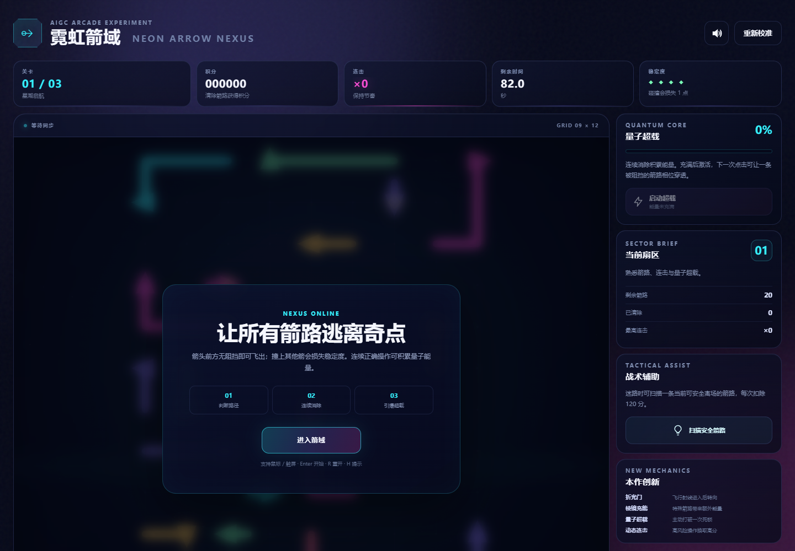
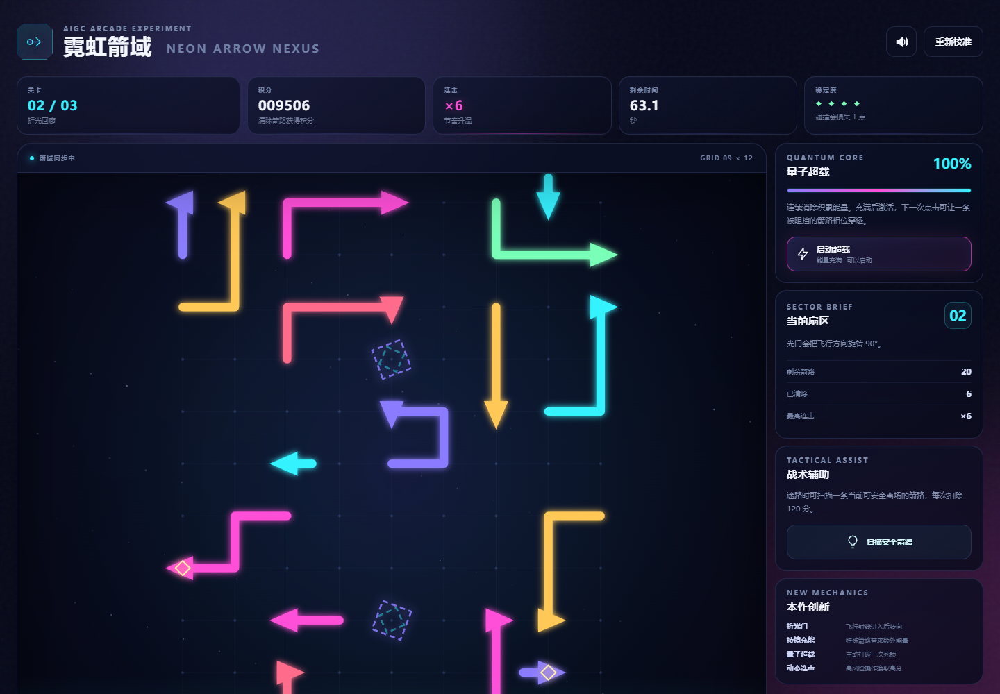
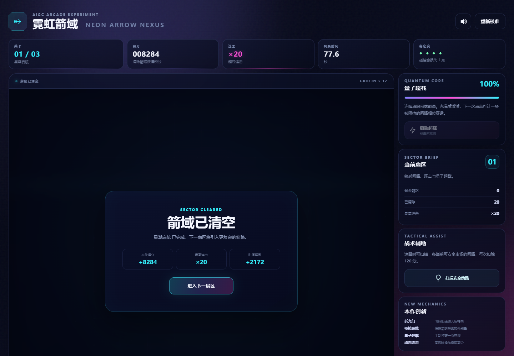
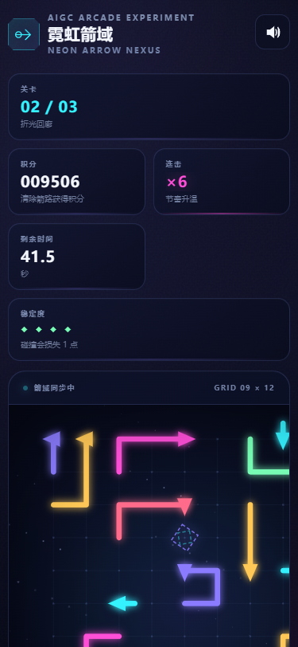

# 2026 秋软件工程个人作业（第二次）——霓虹箭域 Neon Arrow Nexus

| 项目 | 内容 |
| --- | --- |
| 这个作业属于哪个课程 | [202601 软件工程](https://edu.cnblogs.com/campus/fzu/202601S) |
| 这个作业要求在哪里 | [2026 秋软件工程个人作业（第二次）](https://edu.cnblogs.com/campus/fzu/202601SofwareEngineering/homework/16717) |
| 姓名 / 学号 | 【提交前填写】 |
| Git 仓库 | 【提交前填写】 |
| 本次作业目标 | 使用 AIGC 辅助完成“一箭又一箭”小游戏，并在基础玩法上做可验证的创新和完整测试 |

## 一、成品先看

这次我做的版本叫 **“霓虹箭域 Neon Arrow Nexus”**。

核心规则还是“一箭又一箭”：玩家要判断一条箭沿当前方向飞出去时会不会撞到其他箭，路径安全才能消除。不过我不想只照着基础玩法做一个换皮版本，所以又加了折光门、棱镜充能、量子超载和连击系统，并做成三关递进。

整个项目使用原生 HTML、CSS、JavaScript 和 Canvas 2D，没有额外框架依赖。









> 提交到博客园时，需要把上面 4 张仓库内截图上传到博客园图片服务并替换为博客园生成的图片地址；直接复制相对路径到博客园通常无法显示。

## 二、我对原玩法的理解

我把基础玩法拆成了一个比较简单的判断：

1. 每条箭占据若干连续格点，并有一个明确箭头方向；
2. 点击以后，从箭头位置沿方向继续向前检查；
3. 前方遇到其他箭就是碰撞，本次操作失败；
4. 一直走出棋盘边界，则该箭可以被消除；
5. 清空全部箭后过关。

看起来并不复杂，但真正写的时候我发现最大的坑不是动画，而是**随机生成出来的关卡可能根本无解**。如果只是把很多箭随机塞进棋盘，再靠玩家自己尝试，很容易出现互相锁死。

因此我先解决的是“怎么保证关卡真的能通关”，再继续做 UI。

## 三、AIGC 是怎么参与的

我没有采用“一句话让 AI 把整个游戏全部写完，然后直接提交”的方式，而是把问题拆开让 AIGC 分阶段帮忙：

### 1. 第一轮：明确要求

我最开始给 AIGC 的核心要求可以概括成：

```text
完成课程里“一箭又一箭”的个人作业，做到提交之前；
游戏不能只满足最低要求，要有明显的新机制；
视觉上要做得炫彩、有完成度。
```

这一轮最重要的不是代码，而是先把“创新”和“可提交”变成具体目标。

### 2. 第二轮：解决可解性

我继续要求 AI 不要用无法保证结果的纯随机生成。最后确定了“反向构造”的方法：

- 从空棋盘开始；
- 先放最后一个应该被消除的箭；
- 再放倒数第二个，并保证它面对已有箭路时仍然能飞出去；
- 继续往前添加；
- 最后把构造顺序反转，就得到一条完整可行的消除顺序。

这个思路最后同时用在生成器和测试里，而不是只写在报告中。

### 3. 第三轮：要求创新必须影响策略

我不希望所谓“创新”只是粒子变多、颜色更亮，所以继续让 AIGC 从玩法本身扩展。最终保留了四个机制：

- **折光门**：箭经过以后会转 90°；
- **棱镜箭**：消除后额外增加能量；
- **量子超载**：充满后可以穿透一次本来被阻挡的箭；
- **连击系统**：连续判断正确得分越来越高，碰撞会断连击。

这些机制都会改变“我下一步应该点哪条箭”，所以不是单纯的视觉装饰。

### 4. 第四轮：真实运行而不是只看代码

AI 生成代码以后我继续要求做自动测试和浏览器实测。第一次浏览器检查就发现了一个 `favicon.ico 404`。虽然不影响游戏，但控制台会留下红色错误，所以补了 `favicon.svg`，重新开一个干净浏览器后确认：

```text
0 errors, 0 warnings
```

这一点让我觉得 AIGC 比较适合“生成 + 检查 + 修改”的循环，而不是把第一次输出当最终答案。

完整的人机协作记录整理在仓库的 `docs/AIGC_LOG.md`。

## 四、我的创新设计

### 1. 折光门

从第二关开始，棋盘会出现发光的折光门。

箭的飞行射线进入以后会顺时针或逆时针转 90°，然后继续前进。因此玩家不能只观察箭头正前方几格，还要把拐弯后的路线一起考虑。

代码中的射线追踪逻辑和关卡生成使用的是同一套规则，避免出现“画面看起来能走，但引擎认为不能走”的情况。

核心思路如下：

```js
const gate = gatesByCell.get(cellKey);
if (gate) {
  direction = turnDirection(direction, gate.turn);
}
```

### 2. 棱镜充能

部分箭有特殊棱镜标记。它们成功离场后会给更多积分，也会让量子能量更快达到 100%。

这样同样是“当前可以消除”的箭，价值也可能不同。

### 3. 量子超载

连续正确消除可以充能。达到 100% 后，右侧按钮会变成可点击状态。

启动以后，下一次选择一条原本会碰撞的箭时，不扣生命，而是直接进行一次“相位穿透”，随后能量归零。

我把它设计成一次性主动能力，而不是永久无敌，否则会破坏原本的解谜逻辑。

### 4. 连击与风险收益

连续判断正确时，单次得分会增加；棱镜箭还有额外奖励。点错以后连击直接清零。

因此玩家除了“通关”之外，还可以追求更高连击和更高分。

## 五、怎么保证随机关卡有解

这是我觉得这次实现里最值得写的一部分。

假设一关最后的正确顺序是：

```text
A1 → A2 → A3 → ... → An
```

程序生成时不是从 A1 开始，而是反过来：

```text
An
A(n-1)
A(n-2)
...
A1
```

每加入一个新箭，都要求它在“当前已经存在的箭”面前能够安全飞出。因为以后实际游玩时，这些更早加入的箭会更晚才被消除，所以把构造顺序反转后就天然得到一条合法解。

生成完成还不算结束。测试程序会再复制一份完整关卡，然后按照保存的解序真正执行一次：

```js
for (const id of level.solutionOrder) {
  const arrow = remaining.find((item) => item.id === id);
  const trace = traceArrow(arrow, remaining, level.config.gates);
  if (!trace.clear) return false;
  remaining.splice(remaining.findIndex((item) => item.id === id), 1);
}
```

也就是说，“可解”不是我自己看着觉得差不多，而是自动测试必须走到底。

## 六、项目结构

```text
.
├─ index.html
├─ styles.css
├─ favicon.svg
├─ src/
│  ├─ engine.js
│  └─ game.js
├─ scripts/
│  └─ server.mjs
├─ tests/
│  └─ engine.test.mjs
└─ docs/
   ├─ AIGC_LOG.md
   ├─ BLOG_DRAFT.md
   ├─ DESIGN.md
   ├─ TEST_REPORT.md
   └─ SUBMISSION_CHECKLIST.md
```

`engine.js` 只管规则和生成，不依赖浏览器；`game.js` 负责 Canvas、交互、HUD、音效和游戏状态。这样逻辑可以直接在 Node.js 里测试。

## 七、运行方法

本项目没有第三方生产依赖，Node.js 20+ 即可。

```bash
npm start
```

浏览器访问：

```text
http://127.0.0.1:4173
```

自动检查：

```bash
npm run check
```

实际测试结果：

```text
engine.test: 3 deterministic, solvable levels verified.
```

## 八、我实际做了哪些测试

除了语法检查，我还用 Playwright 真正打开浏览器做了交互测试。

| 测试 | 实际结果 |
| --- | --- |
| 页面加载 | 正常 |
| 浏览器控制台 | 0 errors / 0 warnings |
| 第一关箭路数量 | 20 |
| 故意点受阻箭 | 生命 4 → 3，箭没有被错误删除 |
| 第一关完整清空 | PASS |
| 第一关最高连击 | ×20 |
| 结果页 | 正常显示分数、连击、时间奖励 |
| 第二关连续正确 6 次 | 能量达到 100% |
| 启动量子超载后点受阻箭 | 箭成功清除，生命仍为 4，能量 100 → 0 |
| 375 × 812 手机视口 | 已进行真实浏览器截图与响应式检查 |

完整数据在 `docs/TEST_REPORT.md`。

## 九、一些实现细节

### 1. 为什么不用框架

这个作业的重点是小游戏本身，页面规模不大。用原生 Canvas 可以减少依赖和构建步骤，老师下载仓库以后执行 `npm start` 就能看，不需要先处理一堆前端包。

### 2. 为什么做固定随机种子

如果每次刷新都生成完全不同的关卡，测试很难复现。固定 seed 后，每一关既保留程序生成的过程，又能保证测试和演示时看到同一个结果。

### 3. 为什么把测试接口挂到 window

页面额外暴露了一个只用于 QA 的 `window.__NEON_ARROW_GAME__`，Playwright 可以通过它读取当前生命、剩余箭数、能量等真实状态。这样测试不是只看按钮有没有出现，而是能检查游戏内部状态是否真的改变。

## 十、这次使用 AIGC 的体会

这次最明显的感受是：AI 把“从 0 到能运行”的速度拉得很快，但如果不继续追问和测试，很容易停留在一个看起来像成品、实际上没有验证的状态。

比如随机生成关卡这件事，最简单的版本几分钟就能写出来，但有没有死局是另外一个问题；再比如页面能打开，也不代表控制台没有错误、能力按钮真的改变状态。

所以这次我更愿意把 AIGC 当成一个高效率的开发搭档：先让它给方案和代码，再要求它把关键规则转成测试，最后用真实浏览器把流程跑一遍。这样生成代码本身不是终点，最后留下的是一个比较容易复现、也比较容易解释为什么正确的版本。

## 十一、总结

最后完成的版本保留了“一箭又一箭”简单直接的核心交互，同时加入了折光门、棱镜、超载和连击，使关卡判断不再只有直线路径。技术上，我重点处理了随机关卡可解性和可测试性；视觉上则用 Canvas 做了霓虹箭路、粒子、光门和响应式 HUD。

如果后续继续做，我想加的功能是关卡编辑器和每日随机种子，这样可以让同一套规则生成更多可分享的挑战。

